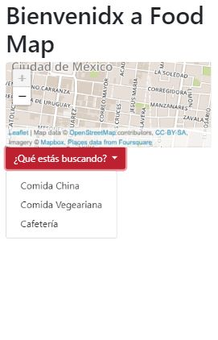
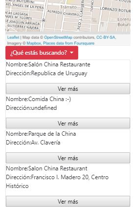

## Food Map

* Esta web app está pensada para que el o la consumidora pueda elegir fácil y rápidamente un lugar para comer.
* Las características de la web app son:

 1. Vista introductoria de transición a la página principal
 2. Mapa que se ubica por las coordenadas del dispositivo al que esté conectado.
 3. Menú dropdown para que el usuario pueda seleccionar 3 diferentes opciones de alimentos.
 3. Una vez hecha la selección, el usuario podrá visualizar una lista de lugares correspondientes.
 4. Los lugares serán los más cercanos respecto a su ubicación (En construcción).
 4. Interfaz responsive, amigable con dispositivos desktop y mobile.
 
 ## Vistas de página principal

  
 

